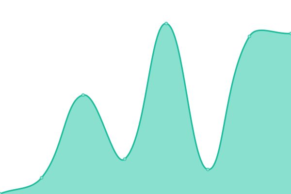
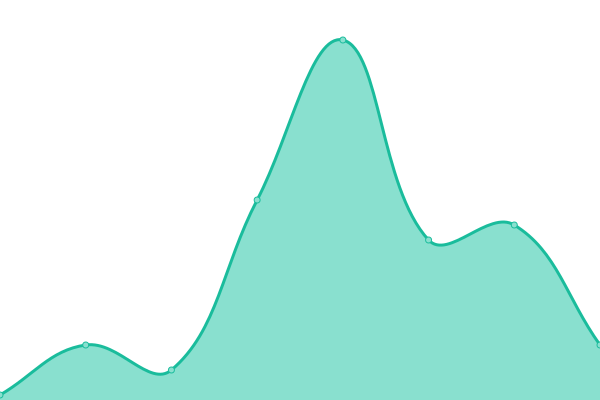

# [📈 Live Status](https://deckerci.github.io/status-ci): <!--live status--> **🟥 Complete outage**

This repository contains the open-source uptime monitor and status page for [Derailed](https://derailedapp.com), powered by [Upptime](https://github.com/upptime/upptime).

With [Upptime](https://upptime.js.org), you can get your own unlimited and free uptime monitor and status page, powered entirely by a GitHub repository. We use [Issues](https://github.com/deckerci/status-ci/issues) as incident reports, [Actions](https://github.com/deckerci/status-ci/actions) as uptime monitors, and [Pages](https://derailedci.github.io/status) for the status page.

<!--start: status pages-->
<!-- This summary is generated by Upptime (https://github.com/upptime/upptime) -->
<!-- Do not edit this manually, your changes will be overwritten -->
<!-- prettier-ignore -->
| URL | Status | History | Response Time | Uptime |
| --- | ------ | ------- | ------------- | ------ |
|  [Derailed Home](https://derailed.one) | 🟥 Down | [derailed-home.yml](https://github.com/derailed-org/derailed-oss-status/commits/HEAD/history/derailed-home.yml) | 

 322ms
     
 | 

<a href="https://status.derailed.one/history/derailed-home">65.92%</a>
    

|  [Derailed API](https://derailed.one/api) | 🟥 Down | [derailed-api.yml](https://github.com/derailed-org/derailed-oss-status/commits/HEAD/history/derailed-api.yml) | 

 102ms
     
 | 

<a href="https://status.derailed.one/history/derailed-api">65.49%</a>
    

|  [Derailed Gateway](https://derailed.one/gateway) | 🟥 Down | [derailed-gateway.yml](https://github.com/derailed-org/derailed-oss-status/commits/HEAD/history/derailed-gateway.yml) | 

 113ms
     
 | 

<a href="https://status.derailed.one/history/derailed-gateway">100.00%</a>
    

<!--end: status pages-->

[**Visit our status website →**](https://derailedci.github.io/status)

## 📄 License

- Powered by: [Upptime](https://github.com/upptime/upptime)
- Code: [MIT](./LICENSE) © [Derailed](https://derailedapp.com)
- Data in the `./history` directory: [Open Database License](https://opendatacommons.org/licenses/odbl/1-0/)
